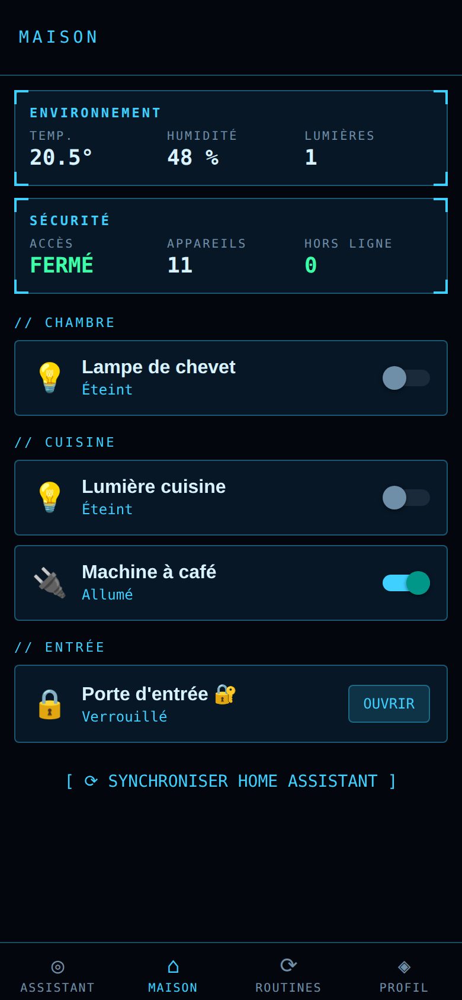
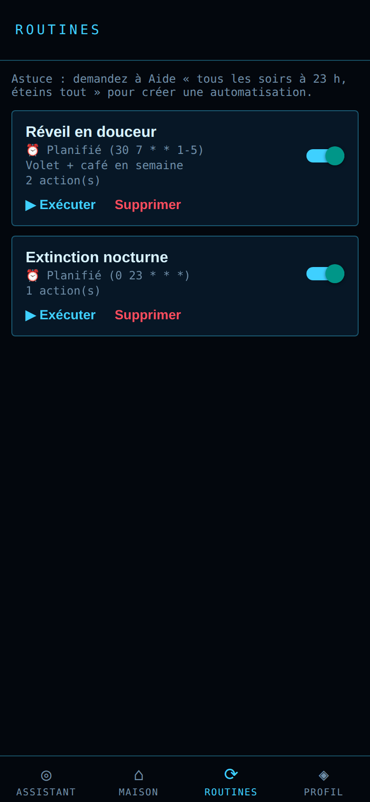

# Aide — assistant personnel intelligent pour la maison connectée

Application mobile (iOS / Android) + serveur domestique qui permet de piloter son domicile en
langage naturel, à la voix ou par écrit, grâce à un agent IA (Claude) connecté à Home Assistant.

<p align="center">
  
  
  
  
</p>

> « Baisse le salon à 30 % », « Il fait combien dans la chambre ? », « Tous les soirs à 23 h,
> éteins tout et ferme les volets », « Rappelle-toi que je préfère 19 °C la nuit ».

## Fonctionnalités

- 💬 **Assistant conversationnel** (texte + voix fr-FR, réponses lues à voix haute) qui agit via 11 outils
- 🏠 **Pilotage** de tout ce que gère Home Assistant : lumières, prises, chauffage, volets, serrures, alarme, médias, aspirateur, scènes…
- 🔐 **Sécurité physique** : serrures / alarme / volets / vannes exigent une confirmation dans l'app, même si l'IA le demande
- ⚙️ **Automatisations** horaires (cron) ou sur événement, créées à la main ou par l'IA
- 🧠 **Mémoire** des préférences et habitudes, consultable et effaçable
- 📡 **Temps réel** (WebSocket) et **notifications push**
- 👥 **Rôles** administrateur / membre / invité, **journal d'audit** de toutes les actions
- 🛰️ **Interface HUD holographique** avec noyau animé qui réagit à l'écoute, l'analyse et la voix

## Documentation

| Document | Contenu |
|---|---|
| [docs/ARCHITECTURE.md](docs/ARCHITECTURE.md) | Architecture, composants, flux, sécurité, déploiement |
| [docs/DATABASE.md](docs/DATABASE.md) | Schéma de données (diagramme ER, tables, formats JSON) |
| [backend/db/schema.sql](backend/db/schema.sql) | DDL PostgreSQL de référence |

## Arborescence

```
backend/   API FastAPI, agent Claude, moteur d'automatisations, adaptateur Home Assistant
mobile/    Application Expo / React Native (TypeScript)
docs/      Architecture et base de données
docker-compose.yml
```

## Démarrage rapide

### 1. Serveur (sur une machine du réseau local)

```bash
cp backend/.env.example backend/.env
# Renseigner : ANTHROPIC_API_KEY, HA_URL, HA_TOKEN (jeton longue durée HA), JWT_SECRET (openssl rand -hex 32)
docker compose up -d                               # API sur :8000 + PostgreSQL
# docker compose --profile homeassistant up -d     # si Home Assistant n'est pas déjà installé
```

### 2. Application mobile

```bash
cd mobile
npm install
# Indiquer l'adresse du serveur dans app.json → expo.extra.apiUrl (ex. http://192.168.1.10:8000)
npx expo run:android    # ou npx expo run:ios
```

La reconnaissance vocale nécessite un *development build* (pas Expo Go). Au premier lancement,
« Première utilisation ? Configurer » crée le compte administrateur ; les autres membres sont
ensuite invités par l'administrateur (`POST /auth/register`).

### 3. Premiers pas

1. Onglet **Maison** → *Synchroniser Home Assistant* importe les appareils.
2. Créer les pièces (`POST /rooms`) et y ranger les appareils (`PATCH /devices/{entity_id}`).
3. Parler à l'assistant depuis l'onglet **Assistant** en touchant le noyau.

## Développement

```bash
cd backend
python -m venv .venv && . .venv/bin/activate
pip install -r requirements-dev.txt
pytest                      # 17 tests (SQLite par défaut ; DATABASE_URL=postgresql+asyncpg://… pour PostgreSQL)
uvicorn app.main:app --reload
```

Documentation interactive de l'API : http://localhost:8000/docs

```bash
cd mobile && npm run typecheck
```
