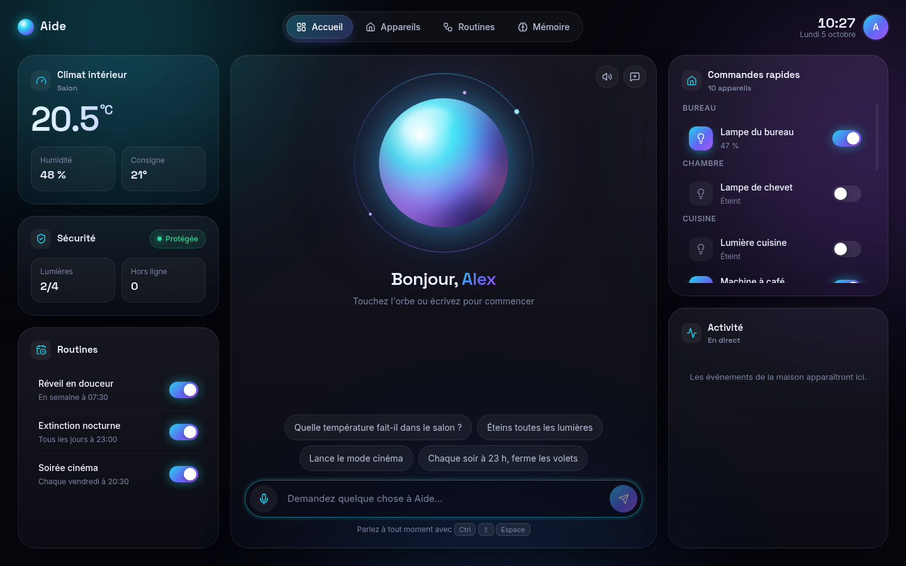
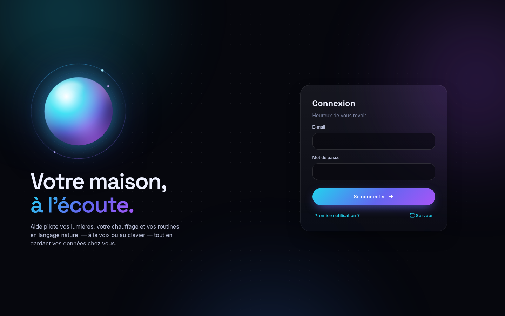
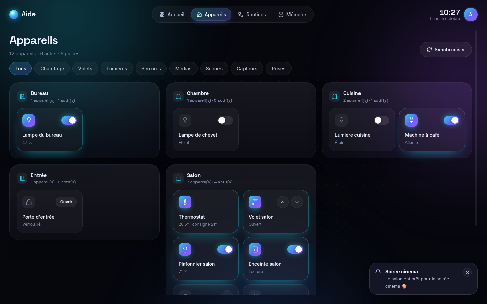
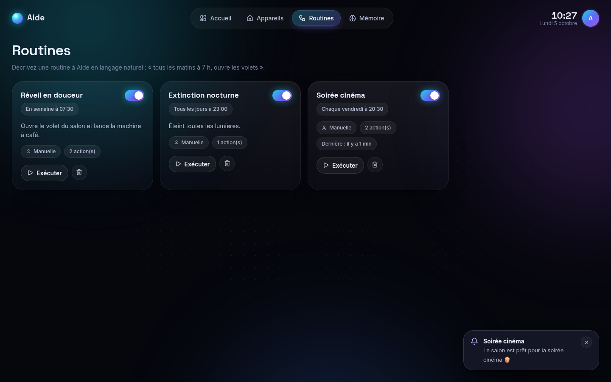

# Aide — assistant personnel intelligent pour la maison connectée

Application de bureau (Windows, macOS, Linux) + serveur domestique pour piloter son domicile en
langage naturel, à la voix ou au clavier, grâce à un agent IA (Claude) connecté à Home Assistant.



<p align="center">
  
  
  
</p>

> « Baisse le salon à 30 % », « Il fait combien dans la chambre ? », « Tous les soirs à 23 h,
> éteins tout et ferme les volets », « Retiens que je préfère 19 °C la nuit ».

## Fonctionnalités

- 💬 **Assistant conversationnel** qui agit sur la maison via 11 outils, réponses lues à voix haute
- 🎙️ **Commande vocale privée** : transcription locale (Whisper) sur votre serveur, raccourci global <kbd>Ctrl</kbd>/<kbd>⌘</kbd>+<kbd>Maj</kbd>+<kbd>Espace</kbd>
- 🏠 **Pilotage** de tout ce que gère Home Assistant : lumières, prises, chauffage, volets, serrures, alarme, médias, scènes…
- 🔐 **Sécurité physique** : serrures, alarme, volets et vannes exigent votre autorisation, même si l'IA le demande
- ⚙️ **Routines** horaires ou sur événement, créées à la main ou en le demandant à l'assistant
- 🧠 **Mémoire** des préférences et habitudes, consultable et effaçable
- 🔔 **Temps réel** et **notifications natives** du système, icône dans la barre système
- 👥 **Rôles** administrateur / membre / invité, **journal d'audit** de toutes les actions
- ✨ **Interface futuriste** : cartes de verre arrondies, fond aurore animé, orbe IA qui réagit à la voix

## Documentation

| Document | Contenu |
|---|---|
| [docs/ARCHITECTURE.md](docs/ARCHITECTURE.md) | Architecture, composants, flux, sécurité, déploiement |
| [docs/DATABASE.md](docs/DATABASE.md) | Schéma de données (diagramme ER, tables, formats JSON) |
| [backend/db/schema.sql](backend/db/schema.sql) | DDL PostgreSQL de référence |

## Arborescence

```
backend/   API FastAPI, agent Claude, Whisper, moteur d'automatisations, adaptateur Home Assistant
desktop/   Application Electron + React + TypeScript
docs/      Architecture, base de données, captures d'écran
docker-compose.yml
```

## Installer Aide sur Windows (le plus simple)

1. Lancez **`Aide-Installation-1.0.0.exe`** (pour le fabriquer : `cd desktop && npm install && npm run dist:win`,
   le fichier apparaît dans `desktop/release/`).
2. Windows peut afficher « Windows a protégé votre ordinateur » (l'application n'est pas signée) :
   cliquez sur **Informations complémentaires**, puis **Exécuter quand même**.
3. Suivez l'installation, puis ouvrez **Aide** depuis le bureau ou le menu Démarrer.
4. Choisissez **Assistant seul** et collez votre clé API Anthropic
   (à créer sur [console.anthropic.com](https://console.anthropic.com/settings/keys), avec un peu de crédit dans *Billing*).

Le mode **Assistant seul** ne demande ni serveur ni Docker : l'application parle directement à Claude.
La maison connectée s'ajoute plus tard depuis les réglages.

## Démarrage rapide

### 1. Serveur (sur l'ordinateur lui-même ou une machine du réseau local)

```bash
cp backend/.env.example backend/.env
# Renseigner : ANTHROPIC_API_KEY, HA_URL, HA_TOKEN (jeton longue durée HA), JWT_SECRET (openssl rand -hex 32)
docker compose up -d                               # API sur :8000 + PostgreSQL
# docker compose --profile homeassistant up -d     # si Home Assistant n'est pas déjà installé
```

### 2. Application de bureau (mode maison connectée)

```bash
cd desktop
npm install
npm run dev     # développement (rechargement à chaud)
npm run dist    # installateur : .exe (Windows), .dmg (macOS), .AppImage (Linux) dans desktop/release/
```

Au premier lancement : lien **Serveur** pour indiquer l'adresse (par défaut `http://localhost:8000`),
puis **Première utilisation ?** pour créer le compte administrateur.

### 3. Premiers pas

1. Onglet **Appareils** → *Synchroniser* importe les appareils de Home Assistant.
2. Créer les pièces (`POST /rooms`) et y ranger les appareils (`PATCH /devices/{entity_id}`).
3. Cliquer sur l'orbe ou appuyer sur <kbd>Ctrl</kbd>+<kbd>Maj</kbd>+<kbd>Espace</kbd> et parler.

## Développement

```bash
cd backend
python -m venv .venv && . .venv/bin/activate
pip install -r requirements-dev.txt          # + requirements-voice.txt pour la voix
pytest                                       # 19 tests (SQLite ; DATABASE_URL=postgresql+asyncpg://… pour PostgreSQL)
uvicorn app.main:app --reload                # documentation interactive : http://localhost:8000/docs

cd ../desktop
npm run typecheck
```
