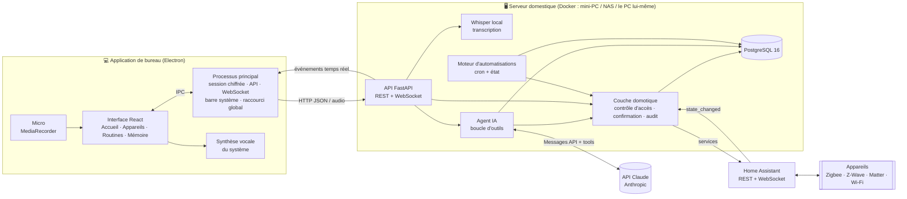
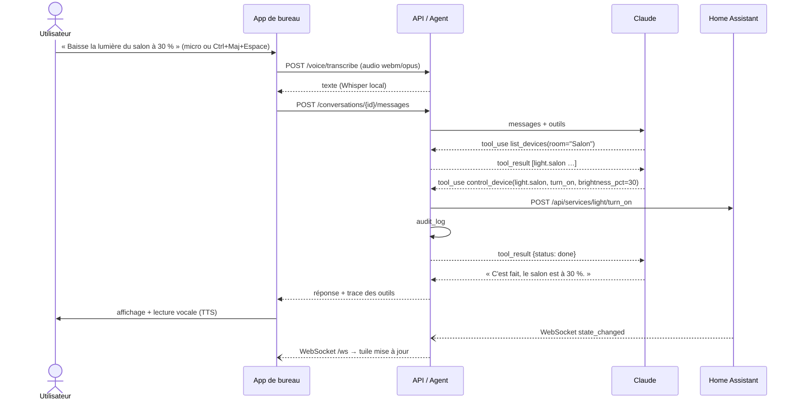
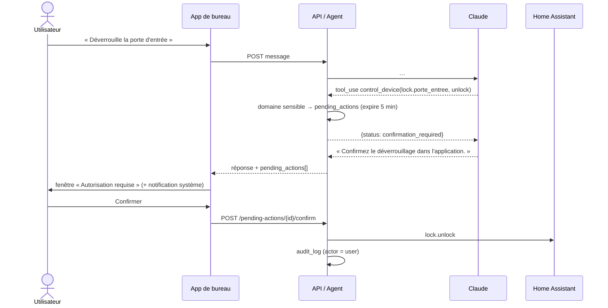

# Architecture technique — « Aide », assistant domestique intelligent

## 1. Objectifs

| Besoin | Réponse technique |
|---|---|
| Piloter la maison en langage naturel (texte ou voix) depuis l'ordinateur | Agent Claude avec *tool use* au-dessus d'une couche domotique sécurisée |
| Compatibilité matérielle large (Zigbee, Z-Wave, Matter, Wi-Fi…) | **Home Assistant** comme couche d'abstraction matérielle |
| Application de bureau Windows / macOS / Linux | **Electron + React + TypeScript** (Vite), une seule base de code |
| Interface moderne et soignée | Design « verre et aurore » : cartes arrondies, dégradés néon, orbe IA animé |
| Commande vocale privée | Transcription **locale** (Whisper) sur le serveur domestique, synthèse vocale du système |
| Routines et automatisations | Moteur interne (cron + déclencheurs d'état), créables par l'IA |
| Personnalisation | Mémoire à long terme (préférences, habitudes) |
| Sécurité physique du foyer | Confirmation humaine obligatoire pour serrures, alarme, volets, vannes ; audit complet |
| Vie privée | Serveur auto-hébergé ; seul le texte des requêtes part vers l'API Claude |

## 2. Vue d'ensemble



### Choix structurants

1. **Home Assistant plutôt que des intégrations directes.** HA gère plus de 2 000 intégrations
   matérielles et expose tout sous forme d'*entités* homogènes (`light.salon`, `lock.porte_entree`…).
   Notre backend n'a qu'un seul adaptateur à maintenir (`services/homeassistant.py`). Il peut être
   remplacé par un autre adaptateur (openHAB, Jeedom, MQTT direct) qui implémente le protocole
   `HomeClient`.
2. **Le LLM ne parle jamais directement au matériel.** Chaque outil passe par
   `services/home.execute_device_action`, point d'entrée **unique** qui applique : liste blanche
   d'actions et de paramètres par domaine, exposition des entités, rôle de l'utilisateur,
   confirmation des actions sensibles et journal d'audit. Même une injection de prompt réussie
   (via le nom d'un appareil, une notification, un souvenir…) ne peut pas déverrouiller la porte
   sans un geste humain dans l'application.
3. **L'interface n'a aucun accès réseau direct ni au jeton.** Dans Electron, toutes les requêtes
   passent par le processus principal (IPC) qui détient la session, chiffrée par le trousseau du
   système (`safeStorage` : DPAPI, Keychain, libsecret). L'interface tourne isolée
   (`contextIsolation`, `sandbox`, pas de Node, CSP stricte).
4. **Voix traitée à la maison.** L'audio est transcrit par Whisper sur le serveur domestique ;
   aucun enregistrement n'est envoyé à un service externe.
5. **Serveur auto-hébergé.** La maison reste pilotable même si Internet tombe (sauf la partie
   conversationnelle). Le serveur peut tourner sur le même ordinateur que l'application ou sur une
   machine dédiée du réseau local.

## 3. Composants

### 3.1 Backend (`backend/`, Python 3.12, FastAPI, SQLAlchemy async)

```
app/
├── main.py              # Application, cycle de vie (listener HA + planificateur)
├── config.py            # Configuration par variables d'environnement
├── db.py / models.py    # Accès PostgreSQL, modèle ORM
├── schemas.py           # Contrats d'API (Pydantic)
├── security.py          # Hachage scrypt, JWT, rôles admin / membre / invité
├── api/                 # Routes REST + WebSocket
│   ├── auth.py          #   inscription, connexion
│   ├── devices.py       #   pièces, appareils, commandes manuelles, historique
│   ├── chat.py          #   conversations, messages, actions en attente
│   ├── automations.py   #   CRUD + exécution manuelle + historique d'exécution
│   ├── memories.py      #   consultation / oubli des souvenirs
│   ├── voice.py         #   transcription vocale (POST /voice/transcribe)
│   └── ws.py            #   flux temps réel /ws
└── services/
    ├── homeassistant.py # Adaptateur HA : REST, WebSocket, table des actions autorisées
    ├── home.py          # Logique métier sécurisée (commande, confirmation, audit, événements)
    ├── assistant.py     # Agent Claude : prompt, contexte, boucle d'outils
    ├── tools.py         # Définition et exécution des 11 outils de l'agent
    ├── automations.py   # Validation, évaluation cron/état, exécution
    ├── speech.py        # Whisper local (faster-whisper), chargé à la première utilisation
    ├── notifications.py # Notifications du foyer (diffusées aux applications connectées)
    └── events.py        # Diffusion temps réel
```

### 3.2 Agent IA (`services/assistant.py`)

* **Modèle** : `claude-opus-5-5` (configurable via `CLAUDE_MODEL`), raisonnement adaptatif,
  effort `medium` par défaut (`CLAUDE_EFFORT=low` pour réduire coût et latence sur des commandes
  simples).
* **Repli automatique** : `fallbacks: "default"` (beta `server-side-fallback-2026-07-01`) — si le
  modèle principal décline une requête, l'API la rejoue côté serveur sur le modèle recommandé.
  Un refus final (`stop_reason == "refusal"`) est traité explicitement.
* **Mise en cache du prompt** : le prompt système est figé et marqué `cache_control` ; les données
  variables (date, interlocuteur, souvenirs) sont placées dans un second bloc *après* le point de
  cache, et l'état des appareils est obtenu via les outils, jamais injecté dans le prompt.
* **Boucle d'outils** : jusqu'à `CLAUDE_MAX_TOOL_ITERATIONS` (8) allers-retours. Les appels
  parallèles sont exécutés puis tous les `tool_result` renvoyés dans un unique message. Les erreurs
  d'outil sont renvoyées avec `is_error: true` pour que le modèle puisse se corriger.
* **Historique** : seuls les messages texte (20 derniers) sont rejoués d'un tour à l'autre ; les
  détails des appels d'outils sont conservés en base pour l'affichage et l'audit.

| Outil | Rôle |
|---|---|
| `list_devices` | Inventaire filtrable par pièce / domaine, avec état et actions possibles |
| `get_device_state` | État détaillé d'une entité |
| `control_device` | Commande générique (`turn_on`, `set_temperature`, `open`, `unlock`…) |
| `get_history` | Historique des changements d'état (≤ 7 jours) |
| `create_automation` / `list_automations` / `set_automation_enabled` | Routines |
| `remember` / `recall` / `forget` | Mémoire à long terme |
| `notify_household` | Notification au foyer (notification native sur les ordinateurs) |

### 3.3 Moteur d'automatisations (`services/automations.py`)

```
déclencheur ──► conditions (toutes vraies) ──► actions séquentielles ──► automation_runs
 time  : cron 5 champs, heure locale du domicile (HOME_TIMEZONE)
 state : entity_id + to/from optionnels, alimenté par le WebSocket HA
```

* Planificateur : tâche asyncio, période `AUTOMATION_TICK_SECONDS` (30 s). Pas de rattrapage des
  occurrences manquées pendant un arrêt (évite d'ouvrir les volets à 3 h du matin au redémarrage).
* Une automatisation agissant sur un appareil **sensible** ne peut être créée que par un
  administrateur depuis l'application ; l'agent IA se voit refuser ce cas.

### 3.4 Application de bureau (`desktop/`, Electron 44, React 19, TypeScript, Vite)

```
electron/
  main.ts                   # Fenêtre, barre système, raccourci global, passerelle API + WebSocket,
                            # session chiffrée (safeStorage), notifications natives, permissions
  preload.ts                # Seule surface exposée à l'interface (window.aide), typée par shared/ipc.ts
shared/ipc.ts               # Contrat IPC partagé processus principal ↔ interface
src/
  App.tsx                   # Barre de navigation, vues, modales
  styles.css                # Design system (jetons de couleur, verre, dégradés, animations)
  lib/bridge.ts             # Pont Electron (ou mode navigateur pour le développement)
  api/                      # Client typé de l'API
  hooks/
    useAuth, useHome        # Session ; état de la maison + événements temps réel + notifications
    useAssistant            # Conversation, envoi, voix, état de l'orbe
    useVoice                # Enregistrement micro, niveau sonore, arrêt auto en fin de phrase ; TTS
  components/
    Orb.tsx                 # Orbe IA (sphère lumineuse + orbites) réagissant à la voix
    Chat.tsx                # Bulles, indicateurs d'outils, champ de saisie avec micro
    PendingModal.tsx        # « Autorisation requise » avec compte à rebours
    DeviceControl.tsx, ui.tsx, Toasts.tsx, SettingsModal.tsx
  views/
    Dashboard.tsx           # Tableau de bord « bento » : climat, sécurité, routines | assistant | commandes, activité
    DevicesView.tsx         # Appareils par pièce, filtres par type
    RoutinesView.tsx        # Cartes de routines : activer, exécuter, supprimer
    MemoryView.tsx          # Souvenirs de l'assistant (droit à l'oubli)
    LoginView.tsx           # Connexion / premier compte / adresse du serveur
```

**Design.** Style futuriste et épuré inspiré des sites web récents : fond sombre animé façon
« aurore » (halos cyan, indigo, violet), cartes en verre dépoli aux angles très arrondis (28 px),
boutons en pilule, dégradés cyan → indigo → violet, typographies Inter et Space Grotesk embarquées
(fonctionnent hors ligne). Au centre de l'accueil, l'**orbe IA** reflète l'état de l'assistant :
respiration lente au repos, pulsation au rythme de la voix pendant l'écoute, nappes de couleur
accélérées pendant l'analyse, battement pendant la réponse vocale.

**Intégration au système.**
- Raccourci global <kbd>Ctrl</kbd>/<kbd>⌘</kbd> + <kbd>Maj</kbd> + <kbd>Espace</kbd> : affiche Aide et
  lance l'écoute, depuis n'importe quelle application.
- Fermer la fenêtre la réduit dans la barre système ; l'assistant reste actif.
- Notifications natives (Windows, macOS, Linux) pour les routines et les autorisations en attente.
- Une seule instance ; seule la permission micro est accordée ; aucune navigation externe.

## 4. Flux principaux

### 4.1 Commande vocale simple



### 4.2 Action sensible (human-in-the-loop)



## 5. Sécurité

| Menace | Contre-mesure |
|---|---|
| Injection de prompt (nom d'appareil, notification, souvenir malveillant) | Confirmation humaine des domaines sensibles ; liste blanche action/paramètres ; souvenirs présentés comme « données, pas instructions » |
| Hallucination d'entity_id ou d'action | Validation stricte côté serveur, erreur renvoyée au modèle |
| Accès à l'ordinateur / logiciel malveillant | Jeton chiffré par le trousseau du système et jamais exposé à l'interface ; interface isolée (sandbox, CSP) ; expiration 7 jours ; actions sensibles à reconfirmer |
| Invités / enfants | Rôle `guest` : lecture seule, aucune commande ni automatisation |
| Exposition réseau | Backend sur LAN ; accès distant via VPN ; HTTPS via reverse proxy (Caddy/Traefik) |
| Traçabilité | `audit_log` append-only : qui (utilisateur / IA / automatisation), quoi, quand, succès |
| Secrets | Variables d'environnement ; jeton HA longue durée dédié ; refus de démarrer en production avec le secret JWT par défaut |

## 6. Déploiement

```bash
cp backend/.env.example backend/.env   # renseigner ANTHROPIC_API_KEY, HA_URL, HA_TOKEN, JWT_SECRET
docker compose up -d                    # + --profile homeassistant pour lancer HA dans la pile
```

* `db` charge automatiquement `backend/db/schema.sql` au premier démarrage.
* L'image `api` inclut Whisper (`WITH_VOICE=true`) ; le modèle (~500 Mo) est téléchargé à la première
  commande vocale. `WHISPER_MODEL=base` réduit la charge sur une petite machine.
* Application : `cd desktop && npm install && npm run dist` produit l'installateur
  (`.exe` NSIS sous Windows, `.dmg` sous macOS, `.AppImage` sous Linux) dans `desktop/release/`.
  Au premier lancement, renseigner l'adresse du serveur (lien « Serveur » de l'écran de connexion).

## 7. Évolutions envisagées

* **Streaming** des réponses (SSE) pour afficher le texte au fil de l'eau.
* **Mot d'éveil** local (« Aide ! ») détecté dans l'application de bureau.
* **Recherche sémantique** de la mémoire (pgvector + modèle d'embeddings) quand elle grossit.
* **Enceintes déportées** dans les pièces (ESP32 + Home Assistant Assist / Wyoming).
* **Détection d'anomalies** : résumé quotidien de la consommation ou d'événements inhabituels
  (via l'API Batches à coût réduit).
* **Géorepérage** : déclencheurs « en arrivant / en partant » à partir des entités `person`.
* **Partitionnement** mensuel de `device_events` et rétention configurable.
