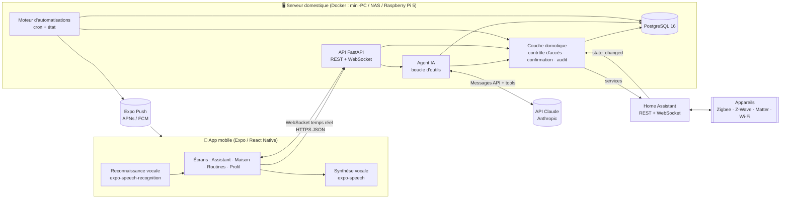
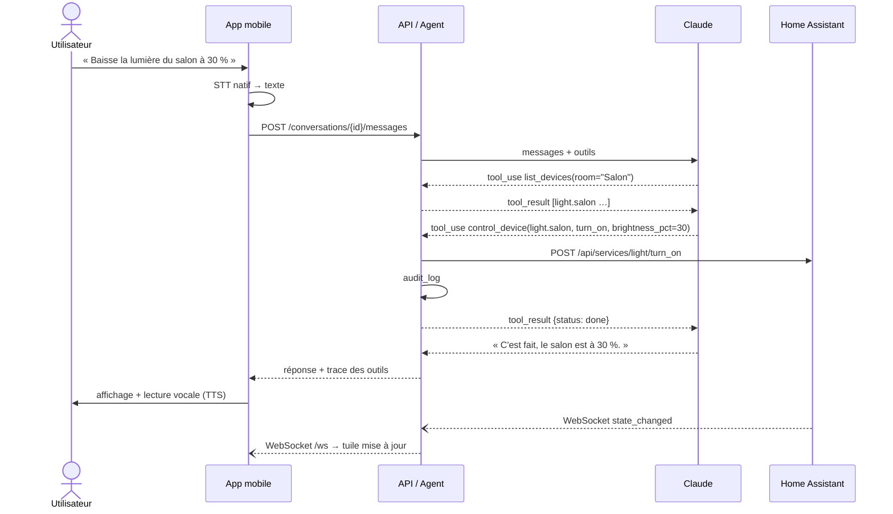
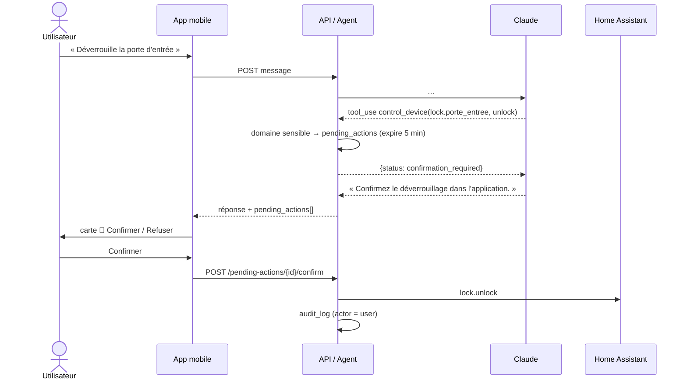

# Architecture technique — « Aide », assistant domestique intelligent

## 1. Objectifs

| Besoin | Réponse technique |
|---|---|
| Piloter la maison en langage naturel (texte ou voix) | Agent Claude avec *tool use* au-dessus d'une couche domotique sécurisée |
| Compatibilité matérielle large (Zigbee, Z-Wave, Matter, Wi-Fi…) | **Home Assistant** comme couche d'abstraction matérielle |
| Application mobile iOS + Android | **React Native / Expo** (TypeScript), une seule base de code |
| Routines et automatisations | Moteur interne (cron + déclencheurs d'état), créables par l'IA |
| Personnalisation | Mémoire à long terme (préférences, habitudes) |
| Sécurité physique du foyer | Confirmation humaine obligatoire pour serrures, alarme, volets, vannes ; audit complet |
| Vie privée | Backend auto-hébergé sur le réseau local ; seul le texte des requêtes part vers l'API Claude |

## 2. Vue d'ensemble



### Choix structurants

1. **Home Assistant plutôt que des intégrations directes.** HA gère plus de 2 000 intégrations
   matérielles et expose tout sous forme d'*entités* homogènes (`light.salon`, `lock.porte_entree`…).
   Notre backend n'a qu'un seul adaptateur à maintenir (`services/homeassistant.py`). Il peut être
   remplacé par un autre adaptateur (openHAB, Jeedom, MQTT direct) qui implémente le protocole
   `HomeClient`.
2. **Le LLM ne parle jamais directement au matériel.** Chaque outil passe par
   `services/home.execute_device_action`, point d'entrée **unique** qui applique : liste blanche
   d'actions et de paramètres par domaine, exposition des entités, rôle de l'utilisateur,
   confirmation des actions sensibles et journal d'audit. Même une injection de prompt réussie
   (via le nom d'un appareil, une notification, un souvenir…) ne peut pas déverrouiller la porte
   sans un geste humain dans l'application.
3. **Backend auto-hébergé.** La maison reste pilotable même si Internet tombe (sauf la partie
   conversationnelle). L'accès hors domicile se fait via VPN (WireGuard/Tailscale) plutôt qu'en
   exposant le port sur Internet.

## 3. Composants

### 3.1 Backend (`backend/`, Python 3.12, FastAPI, SQLAlchemy async)

```
app/
├── main.py              # Application, cycle de vie (listener HA + planificateur)
├── config.py            # Configuration par variables d'environnement
├── db.py / models.py    # Accès PostgreSQL, modèle ORM
├── schemas.py           # Contrats d'API (Pydantic)
├── security.py          # Hachage scrypt, JWT, rôles admin / membre / invité
├── api/                 # Routes REST + WebSocket
│   ├── auth.py          #   inscription, connexion, jeton push
│   ├── devices.py       #   pièces, appareils, commandes manuelles, historique
│   ├── chat.py          #   conversations, messages, actions en attente
│   ├── automations.py   #   CRUD + exécution manuelle + historique d'exécution
│   ├── memories.py      #   consultation / oubli des souvenirs
│   └── ws.py            #   flux temps réel /ws
└── services/
    ├── homeassistant.py # Adaptateur HA : REST, WebSocket, table des actions autorisées
    ├── home.py          # Logique métier sécurisée (commande, confirmation, audit, événements)
    ├── assistant.py     # Agent Claude : prompt, contexte, boucle d'outils
    ├── tools.py         # Définition et exécution des 11 outils de l'agent
    ├── automations.py   # Validation, évaluation cron/état, exécution
    ├── notifications.py # Push Expo
    └── events.py        # Diffusion temps réel vers les apps connectées
```

### 3.2 Agent IA (`services/assistant.py`)

* **Modèle** : `claude-opus-5-5` (configurable via `CLAUDE_MODEL`), raisonnement adaptatif,
  effort `medium` par défaut (`CLAUDE_EFFORT=low` pour réduire coût et latence sur des commandes
  simples).
* **Repli automatique** : `fallbacks: "default"` (beta `server-side-fallback-2026-07-01`) — si le
  modèle principal décline une requête, l'API la rejoue côté serveur sur le modèle recommandé.
  Un refus final (`stop_reason == "refusal"`) est traité explicitement.
* **Mise en cache du prompt** : le prompt système est figé et marqué `cache_control` ; les données
  variables (date, interlocuteur, souvenirs) sont placées dans un second bloc *après* le point de
  cache, et l'état des appareils est obtenu via les outils, jamais injecté dans le prompt.
* **Boucle d'outils** : jusqu'à `CLAUDE_MAX_TOOL_ITERATIONS` (8) allers-retours. Les appels
  parallèles sont exécutés puis tous les `tool_result` renvoyés dans un unique message. Les erreurs
  d'outil sont renvoyées avec `is_error: true` pour que le modèle puisse se corriger.
* **Historique** : seuls les messages texte (20 derniers) sont rejoués d'un tour à l'autre ; les
  détails des appels d'outils sont conservés en base pour l'affichage et l'audit.

| Outil | Rôle |
|---|---|
| `list_devices` | Inventaire filtrable par pièce / domaine, avec état et actions possibles |
| `get_device_state` | État détaillé d'une entité |
| `control_device` | Commande générique (`turn_on`, `set_temperature`, `open`, `unlock`…) |
| `get_history` | Historique des changements d'état (≤ 7 jours) |
| `create_automation` / `list_automations` / `set_automation_enabled` | Routines |
| `remember` / `recall` / `forget` | Mémoire à long terme |
| `notify_household` | Notification push au foyer |

### 3.3 Moteur d'automatisations (`services/automations.py`)

```
déclencheur ──► conditions (toutes vraies) ──► actions séquentielles ──► automation_runs
 time  : cron 5 champs, heure locale du domicile (HOME_TIMEZONE)
 state : entity_id + to/from optionnels, alimenté par le WebSocket HA
```

* Planificateur : tâche asyncio, période `AUTOMATION_TICK_SECONDS` (30 s). Pas de rattrapage des
  occurrences manquées pendant un arrêt (évite d'ouvrir les volets à 3 h du matin au redémarrage).
* Une automatisation agissant sur un appareil **sensible** ne peut être créée que par un
  administrateur depuis l'application ; l'agent IA se voit refuser ce cas.

### 3.4 Application mobile (`mobile/`, Expo SDK 57, React Native 0.86, TypeScript strict)

```
App.tsx                       # Navigation par onglets, garde d'authentification
src/api/{client,types}.ts     # Client REST typé, gestion des erreurs et du 401
src/context/AuthContext.tsx   # Session (jeton JWT dans expo-secure-store / Keychain / Keystore)
src/hooks/useHomeEvents.ts    # WebSocket temps réel avec reconnexion exponentielle
src/notifications.ts          # Enregistrement Expo Push
src/screens/
  ChatScreen.tsx              # Conversation, micro (STT fr-FR), réponses vocales (TTS), confirmations
  DevicesScreen.tsx           # Appareils par pièce, commandes directes, mises à jour live
  AutomationsScreen.tsx       # Routines : activer, exécuter, supprimer
  SettingsScreen.tsx          # Profil, notifications, souvenirs (droit à l'oubli)
  LoginScreen.tsx             # Connexion / création du compte administrateur initial
src/components/
  PendingActionCard.tsx       # Carte « Confirmer / Refuser » des actions sensibles
  DeviceTile.tsx              # Tuile d'appareil adaptée au domaine
  ArcOrb.tsx                  # Noyau holographique animé (états repos / écoute / analyse / voix)
  HudPanel.tsx, HudClock.tsx  # Panneaux et horloge style affichage tête haute
```

**Design « HUD holographique ».** L'interface s'inspire des affichages tête haute de science-fiction :
fond nuit, lignes cyan lumineuses, accents orange, typographie à chasse fixe, panneaux à coins en
équerre (`HudPanel`). Au centre de l'écran Assistant, un **noyau holographique animé** (`ArcOrb`,
`react-native-svg`) reflète l'état de l'assistant : rotation lente au repos, accélération en écoute,
anneaux orange rapides pendant l'analyse, pulsation pendant la réponse vocale. Toucher le noyau
active le micro. Toutes les couleurs sont centralisées dans `src/config.ts`.

La reconnaissance vocale utilise les moteurs natifs (Apple Speech / Google) : aucun audio n'est
envoyé au backend. `expo-speech-recognition` nécessitant du code natif, l'application se lance
avec un *development build* (`npx expo run:ios|android`) et non dans Expo Go.

## 4. Flux principaux

### 4.1 Commande vocale simple



### 4.2 Action sensible (human-in-the-loop)



## 5. Sécurité

| Menace | Contre-mesure |
|---|---|
| Injection de prompt (nom d'appareil, notification, souvenir malveillant) | Confirmation humaine des domaines sensibles ; liste blanche action/paramètres ; souvenirs présentés comme « données, pas instructions » |
| Hallucination d'entity_id ou d'action | Validation stricte côté serveur, erreur renvoyée au modèle |
| Vol de téléphone | JWT stocké dans Keychain/Keystore ; expiration 7 jours ; actions sensibles à reconfirmer |
| Invités / enfants | Rôle `guest` : lecture seule, aucune commande ni automatisation |
| Exposition réseau | Backend sur LAN ; accès distant via VPN ; HTTPS via reverse proxy (Caddy/Traefik) |
| Traçabilité | `audit_log` append-only : qui (utilisateur / IA / automatisation), quoi, quand, succès |
| Secrets | Variables d'environnement ; jeton HA longue durée dédié ; refus de démarrer en production avec le secret JWT par défaut |

## 6. Déploiement

```bash
cp backend/.env.example backend/.env   # renseigner ANTHROPIC_API_KEY, HA_URL, HA_TOKEN, JWT_SECRET
docker compose up -d                    # + --profile homeassistant pour lancer HA dans la pile
```

* `db` charge automatiquement `backend/db/schema.sql` au premier démarrage.
* Mobile : renseigner `expo.extra.apiUrl` dans `mobile/app.json`, puis `npm install` et
  `npx expo run:android` (ou `run:ios`). Pour la distribution : EAS Build.

## 7. Évolutions envisagées

* **Streaming** des réponses (SSE) pour afficher le texte au fil de l'eau.
* **Recherche sémantique** de la mémoire (pgvector + modèle d'embeddings) quand elle grossit.
* **Mot d'éveil** et enceintes déportées (ESP32 + Home Assistant Assist / Wyoming).
* **Détection d'anomalies** : résumé quotidien de la consommation ou d'événements inhabituels
  (via l'API Batches à coût réduit).
* **Géorepérage** : déclencheurs « en arrivant / en partant » à partir des entités `person`.
* **Partitionnement** mensuel de `device_events` et rétention configurable.
