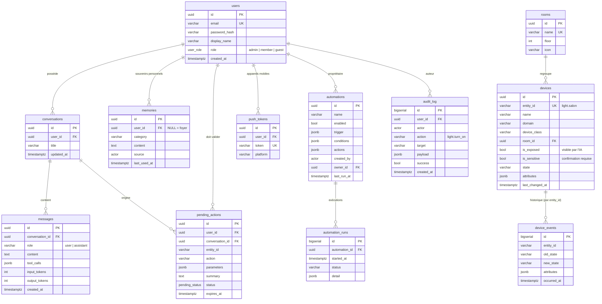

# Schéma de base de données

Référence exécutable : [`backend/db/schema.sql`](../backend/db/schema.sql) (PostgreSQL 16).
Le modèle ORM [`backend/app/models.py`](../backend/app/models.py) en est le miroir exact.

## Diagramme entité-relation



## Tables

| Table | Rôle | Volume attendu |
|---|---|---|
| `users` | Habitants et invités, rôle `admin` / `member` / `guest` | Quelques lignes |
| `push_tokens` | Jetons Expo Push par téléphone | Quelques lignes |
| `rooms` | Pièces (organisation de l'app et filtre `list_devices`) | ~10–30 |
| `devices` | Miroir des entités HA utiles + réglages propres à l'assistant | ~50–500 |
| `device_events` | Historique des changements d'état | **Élevé** : 10⁴–10⁵ / jour |
| `conversations` / `messages` | Historique conversationnel + trace des outils + tokens consommés | Modéré |
| `memories` | Préférences et habitudes durables | ~10–500 |
| `pending_actions` | Commandes sensibles en attente (TTL 5 min) | Faible |
| `automations` / `automation_runs` | Routines et journal d'exécution | Faible / modéré |
| `audit_log` | Journal append-only de toute action physique | Modéré |

## Formats JSONB

**`automations.trigger`**
```json
{"type": "time",  "cron": "30 7 * * 1-5"}
{"type": "state", "entity_id": "binary_sensor.porte_garage", "to": "on", "from": "off"}
```

**`automations.conditions`** — toutes doivent être vraies au moment du déclenchement
```json
[{"entity_id": "person.alex", "state": "not_home"}]
```

**`automations.actions`** — exécutées dans l'ordre
```json
[
  {"type": "device", "entity_id": "light.salon", "action": "turn_on", "parameters": {"brightness_pct": 30}},
  {"type": "notify", "message": "La porte du garage est restée ouverte"}
]
```

**`messages.tool_calls`**
```json
[{"name": "control_device", "input": {"entity_id": "light.salon", "action": "turn_off"}, "is_error": false}]
```

## Choix de conception

* **UUID** pour les entités exposées dans l'API (non devinables), **BIGSERIAL** pour les journaux
  volumineux (`device_events`, `automation_runs`, `audit_log`).
* **`device_events` référence `entity_id` sans clé étrangère** : l'historique survit à la
  suppression d'un appareil, et l'insertion à haut débit n'est pas ralentie par la contrainte.
* **États dupliqués dans `devices`** : l'agent lit l'état depuis PostgreSQL (mis à jour en continu par
  le WebSocket HA) plutôt que d'interroger HA à chaque outil.
* **Index d'expression** `automations ((trigger->>'entity_id')) WHERE enabled` pour retrouver vite les
  règles concernées par un événement.
* **Rétention** : purger `device_events` au-delà de 90 jours (tâche cron
  `DELETE FROM device_events WHERE occurred_at < now() - interval '90 days'`) ou partitionner par mois.
* **RGPD / vie privée** : les souvenirs sont consultables et supprimables depuis l'app ; la
  suppression d'un utilisateur supprime en cascade ses conversations, souvenirs et jetons.
